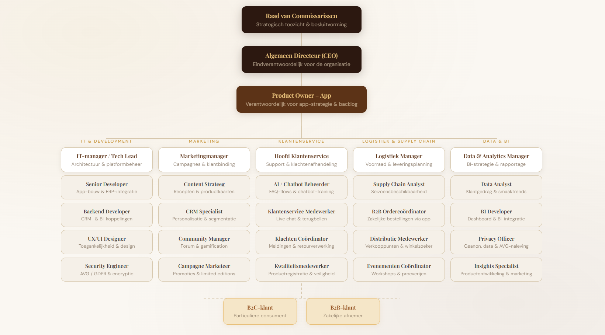
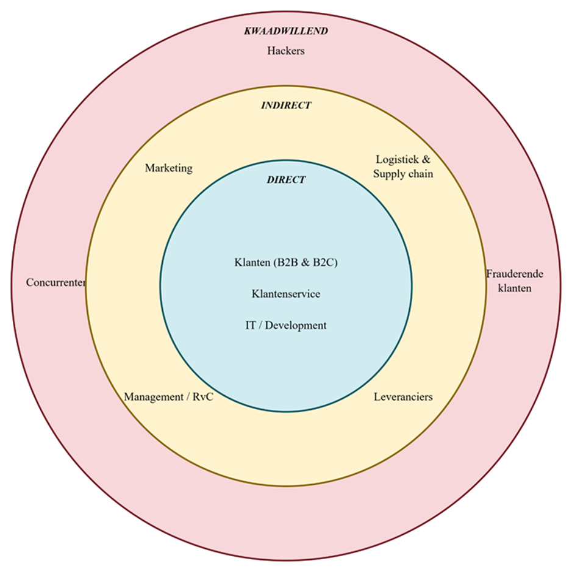

# Organisatorische Context

## Introductie

De Chocolate Firm is een organisatie die zich richt op het leveren van hoogwaardige chocoladeproducten aan zowel particuliere als zakelijke klanten. Om de klantervaring te verbeteren en klantloyaliteit te versterken, wordt een mobiele applicatie ontwikkeld die fungeert als centraal digitaal platform.

---

## Missie

De Chocolate Firm verbindt klanten met de wereld van chocolade door transparantie, kwaliteit en persoonlijke service centraal te stellen. De mobiele applicatie is de digitale uitdrukking van die verbinding: één platform waar klanten alles vinden wat zij nodig hebben, van productinformatie tot directe ondersteuning.

---

## Visie

De Chocolate Firm wil de meest klantgerichte chocoladeaanbieder van Europa zijn. Niet alleen in de winkel of via de verkoopafdeling, maar op elk moment en via elk kanaal. De applicatie maakt dat mogelijk door klanten zelfstandig te laten handelen, zonder afhankelijk te zijn van tussenkomst van medewerkers. Tegelijkertijd biedt het bedrijf ruimte voor persoonlijk contact wanneer dat nodig is.

Klantloyaliteit ontstaat niet door kortingen alleen. Het ontstaat wanneer klanten het gevoel hebben dat een bedrijf hen kent, begrijpt en serieus neemt. De applicatie ondersteunt dat gevoel door gepersonaliseerde informatie, proactieve communicatie en een betrouwbare afhandeling van vragen en klachten.

---

## Strategie

De ontwikkeling van de applicatie volgt een klantgerichte strategie die rust op drie pijlers: toegankelijkheid, integratie en data.

**Toegankelijkheid** betekent dat de applicatie voor iedere klant bruikbaar is, ongeacht technische kennis, taal of beperking. Meertalige ondersteuning, toegankelijkheidsfuncties en een intuïtieve navigatie zorgen ervoor dat zowel particuliere als zakelijke klanten de weg vinden zonder drempel.

**Integratie** betekent dat de applicatie geen losstaand product is, maar een verlengstuk van de bestaande bedrijfsvoering. De koppeling met het ERP-systeem, het CRM en de BI-tool zorgt voor actuele en betrouwbare informatie. Klanten zien realtime voorraadstatus, kunnen direct bestellen en volgen de afhandeling van meldingen zonder te hoeven bellen of mailen. Interne afdelingen, van logistiek tot marketing, werken met dezelfde databron.

**Data** vormt de derde pijler. Iedere interactie in de applicatie levert inzichten op die de Chocolate Firm in staat stellen sneller en gerichter te handelen. Smaaktrends, aankooppatronen en klachtenanalyses worden gebruikt om producten te verbeteren, campagnes te verfijnen en voorraadplanning aan te scherpen. Gegevens worden geanonimiseerd verwerkt en de klant behoudt altijd controle over zijn eigen privacyinstellingen, in lijn met de AVG.

De strategie is gericht op de lange termijn. De modulaire opbouw van de applicatie maakt het mogelijk nieuwe functionaliteiten toe te voegen naarmate de organisatie groeit of de markt verandert. Denk aan loyaliteitsprogramma's, augmented reality-ervaringen of uitgebreidere duurzaamheidsrapportages per product.

---

## Doelstellingen

Met de mobiele applicatie wil de Chocolate Firm de volgende doelstellingen behalen:

- Klantloyaliteit vergroten
- Klantbetrokkenheid verhogen
- Servicekosten verlagen door self-service
- Datagedreven beslissingen verbeteren
- Een concurrentievoordeel behalen

---

## Organogram

---

## UI Diagram

---

## Stakeholders

1.	Klanten (B2B & B2C)
2.	Klantenservice 
3.	Marketing
4.	IT / Development
5.	Logistiek en Supply chain
6.	Leveranciers
7.	Management / Raad van commissarissen 
8.	Hackers
9.	Concurrenten
10.	Frauderende klanten 

### Prioritering

| Direct | Kwaadwillend | Indirect |
|--------|--------------|----------|
| Klanten (B2B & B2C) | Hackers | Marketing |
| Klantenservice | Concurrenten | Logistiek & Supply chain |
| IT / Development | Frauderende klanten | Management / RvC |
| | | Leveranciers |

### Belangen

| Stakeholder | Impact | Voordelen | Nadelen |
|-------------|--------|-----------|---------|
| Klanten (B2C) | Hoog | 24/7 zelfstandig bestellen en volgen; persoonlijke aanbevelingen op basis van aankoophistorie; snellere klachtafhandeling | Persoonsgegevens worden verzameld; afhankelijkheid van digitaal kanaal; leercurve voor minder digitaal vaardige gebruikers |
| Klanten (B2B) | Hoog | Realtime voorraad- en leverstatussen; minder administratie via ERP-koppeling; directe lijn voor bulkorders | Bedrijfsdata deels zichtbaar voor de Chocolate Firm; vergt integratiewerk aan hun kant; afhankelijkheid van uptime van de app |
| Klantenservice | Hoog | Minder inkomende telefoontjes door self-service; volledige klanthistorie direct inzichtelijk; gestandaardiseerde klachtafhandeling | Hogere verwachtingen van klanten door snellere kanalen; training nodig voor nieuw systeem; afhankelijkheid van correcte CRM-data |
| IT / Development | Hoog | Centrale databron vermindert ad hoc koppelingswerk; modulaire opbouw maakt uitbreidingen eenvoudiger; duidelijke requirements versnellen ontwikkeling | Hoge werkdruk bij integraties met ERP, CRM en BI; verantwoordelijk bij beveiligingsincidenten; beperkte capaciteit voor beheer na livegang |
| Management / RvC | Hoog | Datagedreven sturing op KPI's; concurrentievoordeel in digitale kanalen; lagere servicekosten door self-service | Hoge initiële investering; reputatieschade bij beveiligingsincident; ROI onzeker op korte termijn |
| Hackers | Hoog | — | Datalekken met AVG-boetes tot gevolg; DDoS-aanvallen op de app-infrastructuur; reputatieschade bij publieke incidenten |
| Marketing | Midden | Rijkere klantdata voor segmentatie; directe pushnotificaties naar klanten; meetbare campagneresultaten via app-data | AVG beperkt gebruik van persoonsgegevens; afhankelijk van IT voor datatoegankelijkheid; risico op overmatige notificaties irriteert klanten |
| Logistiek & Supply chain | Midden | Minder fouten door directe ERP-koppeling; betere vraagvoorspelling via app-data; realtime inzicht in orderstatus voor klanten | Hogere verwachting rondom levertijden; piekbelasting bij campagnes of seizoenen; foutieve voorraaddata schaadt klantvertrouwen |
| Frauderende klanten | Midden | — | Financiële schade door retour- en kortingsfraude; vervuilde klantdata verstoort analyses; hogere workload klantenservice |

---

## Toekomstvisie

De applicatie wordt modulair en schaalbaar ontwikkeld, zodat toekomstige uitbreidingen mogelijk zijn zoals loyaliteitsprogramma's, augmented reality-ervaringen en uitgebreide duurzaamheidsinzichten per product.

---

| [< Overzicht](README.md) | [Actoren >](actoren.md) |
|:---|---:|
| *Vorige pagina* | *Volgende pagina* |