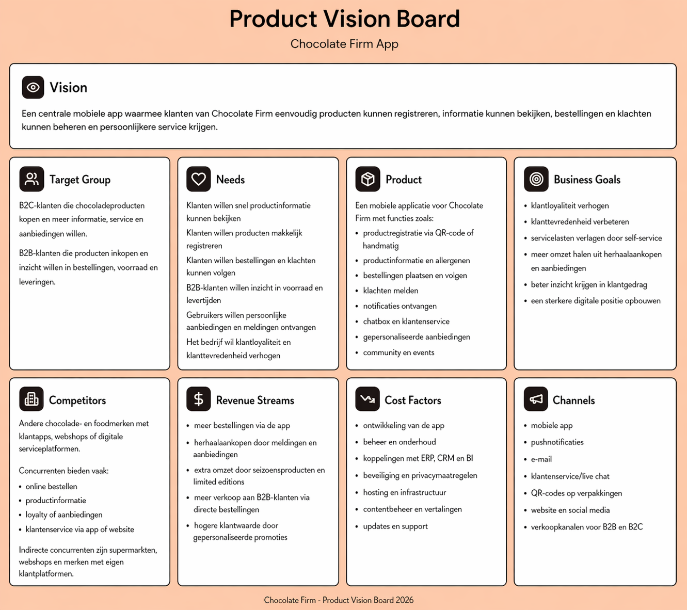

# Productvisie

Dit document bevat de productvisie voor de mobiele applicatie van The Chocolate Firm. De productvisie is uitgewerkt aan de hand van het Product Vision Board.

---

## Product Vision Board

---

## Toelichting

The Chocolate Firm ontwikkelt een mobiele applicatie die klanten een centraal platform biedt voor alles rondom hun chocoladeproducten. De app richt zich op drie hoofddoelen: het verbeteren van de klantervaring, het verhogen van klantloyaliteit en het verlagen van servicekosten door self-service. De applicatie koppelt met het ERP-, CRM- en BI-systeem van de organisatie, zodat klanten realtime toegang hebben tot productinformatie, bestellingen en klachtstatus. Medewerkers krijgen hierdoor minder handmatig werk en meer inzicht in klantgedrag.

---

| [< Bedrijfsprocesanalyse](bedrijfsprocesanalyse.md) | [User Stories >](user-stories/README.md) |
|:---|---:|
| *Vorige pagina* | *Volgende pagina* |